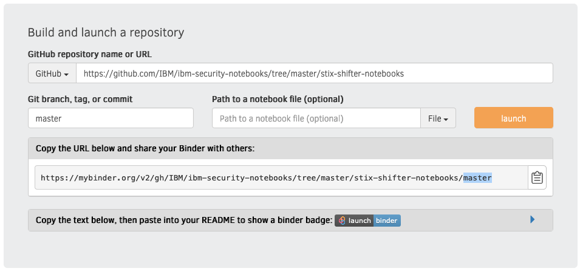

# ibm-security-notebooks
Jupyter notebook collection for use with IBM Security products. These notebooks can be used by security analysts or threat hunters investigating security incidents on QRadar or CloudPak for security platform. 

Sample notebooks provide an example or a template to build upon for specific exporation.

# How to open notebooks in Binder
- Go to Binder https://mybinder.org/
- Provide Github repository URL and branch name or commit
- Push Launch button
